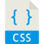

## 🔧 Technologies & Tools

 
 

## 📫 Contact

How to reach me: [LinkedIn](https://www.linkedin.com/in/bidoc/) - feel free to contact me!

### Curriculum vitae

[][cv]

[cv]: https://github.com/bidodev/bidodev/blob/master/claudinei.bido.cv.pdf
